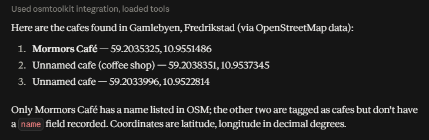
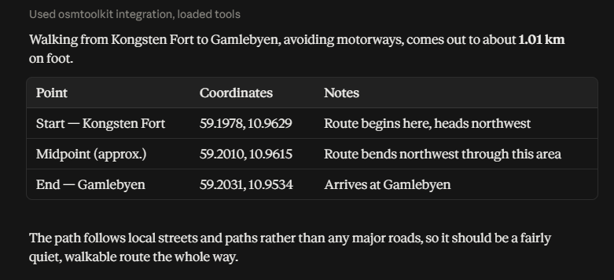
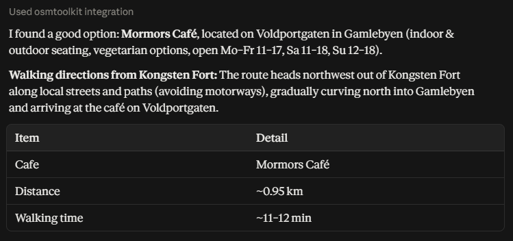
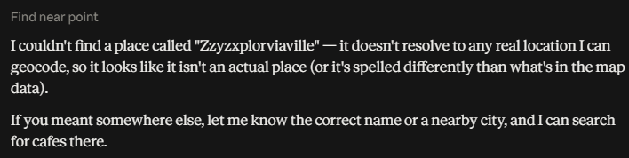

# OsmToolkit

A .NET 8 library for reading, writing, searching, and analysing [OpenStreetMap](https://www.openstreetmap.org/) data — and an [MCP](https://modelcontextprotocol.io/) server that exposes it to AI agents like Claude, so they can answer geographic questions ("what cafes are near Oslo City Hall?", "route me from A to B on foot") against live map data instead of guessing.

## Why this exists

OsmToolkit started as a four-person group project at Høgskolen i Østfold (releases 1.0.0–2.0.0), built for reading and querying local `.osm` XML files. I've continued it solo since, and used it as a vehicle to practice something specific: taking a library from "works on my machine with a file I already have" to "backs a tool an AI agent calls live, and doesn't fall over when the outside world misbehaves."

That meant adding the pieces a static file didn't need: a live Overpass data source, spatial indexing for nearby-node queries, an MCP server exposing three tools, and — the part that took the most iterations — retry, timeout, and error handling that reacts to how a free public API (Overpass, Nominatim) actually fails under load, not how it fails in the happy path. The [Decisions](#decisions) section below covers what was measured to get there.

The original group project's own API documentation is kept in `docs/` for reference (`APIRef.pdf`, `release1_dokumentasjon_gruppe8.pdf`, `release2_dokumentasjon_gruppe8.pdf`) — it predates the Overpass/MCP work covered here and describes the file-based 1.0.0/2.0.0 API only.

## Architecture

```
                     ┌─────────────────────────┐
   Claude Desktop /  │      OsmToolkit.Mcp      │
   any MCP client  ──┼─▶  find_near_point        │
   (stdio transport)  │  search_by_tags_in_area  │
                     │  route_between_points     │
                     └────────────┬─────────────┘
                                  │ IOsmDataSource / ITagFilteredOsmDataSource / IPlaceLookup
                     ┌────────────▼─────────────┐
                     │        OsmToolkit          │
                     │  (registered via           │
                     │   AddOsmToolkit())         │
                     ├────────────────────────────┤
                     │ Geocoding  → Nominatim      │
                     │ DataSources → Overpass API  │
                     │   (retry, in-flight         │
                     │    coalescing, caching)     │
                     │ Finders → grid-indexed      │
                     │   nearby/radius/path search │
                     │ Serialization → .osm XML/   │
                     │   JSON read & write         │
                     └────────────────────────────┘
```

- **`OsmToolkit`** — the core library. Everything is interface-driven and registered through `AddOsmToolkit()` (`OsmToolkit/Setup/ServiceCollectionExtensions.cs`), so a consumer only ever depends on interfaces (`IOsmDataSource`, `IOsmFinderV2<T>`, `IPlaceLookup`, ...), never concrete classes.
  - `Serialization` — read/write `.osm` XML and JSON.
  - `DataSources` — `OverpassOsmDataSource` fetches live data from the Overpass API, with bounded retry (ADR-10), in-flight fetch coalescing, and an `IMemoryCache`-backed cache.
  - `Geocoding` — `NominatimPlaceLookup` resolves a free-text place name to coordinates.
  - `Finders` — `OsmEntityFinder` implements nearest-node, within-radius, within-path-distance, and shortest-path search, backed by a lazily-built grid spatial index (ADR-07) cached per `OsmData` instance.
- **`OsmToolkit.Mcp`** — a thin MCP server (stdio transport) built on the official `ModelContextProtocol` SDK. Each tool is a `[McpServerToolType]` wrapper with no logic of its own, delegating to a handler that composes the core library's interfaces. Overpass/HTTP fetch failures are wrapped into a single `OsmDataUnavailableException` (ADR-11), and both that and a failed place lookup are translated into a client-visible error message (ADR-12) rather than a raw exception dump.
- **`OsmToolkitTests`** — MSTest, 349 automated tests, plus a small set of opt-in `ManualIntegration`-tagged benchmarks that hit the real Overpass/Nominatim services (used to produce the numbers in ADR-08 and ADR-09).

### MCP tools

| Tool | What it does |
|---|---|
| `find_near_point` | Nearest OSM nodes to a named place, optionally tag-filtered, within a radius. |
| `search_by_tags_in_area` | All entities matching tag filters (e.g. `amenity=cafe`) within a named place. |
| `route_between_points` | Shortest route between two named places, by travel mode, optionally avoiding motorways. |

All three take a free-text place name and geocode it via Nominatim before querying Overpass — no coordinates required from the caller.

## Getting started

### Prerequisites

- [.NET 8 SDK](https://dotnet.microsoft.com/download/dotnet/8.0)

### Build and test

```bash
dotnet build
dotnet test
```

`dotnet test` runs 349 automated unit/integration tests. The `ManualIntegration`-tagged benchmark tests are excluded by default (they hit live Overpass/Nominatim endpoints); run them explicitly with `dotnet test --filter TestCategory=ManualIntegration` if you want fresh numbers.

### Run the MCP server standalone

```bash
dotnet run --project OsmToolkit.Mcp
```

This starts the server on stdio and waits for a client to connect — there's nothing to see until one does.

### Connect it to Claude Desktop

Add an entry to Claude Desktop's config file (`%APPDATA%\Claude\claude_desktop_config.json` on Windows, `~/Library/Application Support/Claude/claude_desktop_config.json` on macOS):

```json
{
  "mcpServers": {
    "osmtoolkit": {
      "command": "dotnet",
      "args": ["run", "--project", "C:\\path\\to\\osmtoolkit\\OsmToolkit.Mcp"]
    }
  }
}
```

Restart Claude Desktop. The three tools above should show up under the 🔨 tools icon in a new conversation, and Claude will call them automatically when a question needs live map data.

### Use the core library directly

```csharp
var services = new ServiceCollection();
services.AddOsmToolkit();
var provider = services.BuildServiceProvider();

// Fetch live data for an area
var dataSource = provider.GetRequiredService<IOsmDataSource>();
var data = await dataSource.GetOsmDataAsync(new OsmCoordinateBounds(59.20, 10.90, 59.22, 10.95));

// Or read a local .osm file instead
var deserializer = provider.GetRequiredService<IOsmXmlDeserializer>();
var fileData = await deserializer.DeserializeFromFileAsync("map.osm");

// Search it
var finder = provider.GetRequiredService<IOsmFinderV2<OsmEntity>>();
var nearby = finder.FindNearByRadius(data, lat: 59.21, lon: 10.93, radiusMeters: 500);
```

> **Note on large files:** deserializing very large `.osm` extracts is memory-hungry — the whole of Norway (~200M nodes) took 144 minutes and the full 32 GB of RAM available during testing. Smaller regional extracts work fine; this is a known limitation, not a bug.

## Decisions

Full reasoning lives in `docs/decisions/` as ADRs. A few worth calling out, because the headline is "measured, not guessed":

- **[ADR-03](docs/decisions/03-ingen-retry-i-osmdatasource.md) — no retry, by default, at the data-source layer.** Overpass is a free shared service that returns 429/504 under load. Rather than silently hiding that behind retries a caller might not want, the original design surfaced failures immediately and left retry as the caller's decision. This wasn't an oversight — it's a documented default that later got revised (see ADR-10) once there was an actual caller (the MCP server) with no better place to put it.
- **[ADR-08](docs/decisions/08-measuring-the-grid-index-found-a-different-bottleneck.md) — the spatial index worked, benchmarking found the next bottleneck.** The grid index (ADR-07) gave a real 14x speedup on node search, confirmed against a live 220k-node Fredrikstad extract — but the same benchmark showed the *end-to-end* `FindNearByRadius` call was only 1.4x faster overall, because way/relation lookup (never indexed) had become the new dominant cost. Rather than declaring victory on the design alone, the follow-up cost was measured, named, and scoped as its own issue.
- **[ADR-09](docs/decisions/09-network-latency-dwarfs-18-and-23-in-a-real-mcp-call.md) — two known, real inefficiencies turned out not to matter yet.** With a full `find_near_point` call benchmarked end to end (geocoding + Overpass fetch + finder logic), the entire finder layer — including the ADR-08 gap — came out to under 1% of total latency; geocoding and the network fetch are ~98% of the cost. Both known issues stayed open and explicitly deprioritized rather than "fixed" against a cost that isn't there in practice — a call that only measuring the whole path, not just the layer being changed, could support.
- **[ADR-10](docs/decisions/10-bounded-retry-in-overpassosmdatasource.md) — retry came back, bounded, once it was needed.** Manual testing of the MCP tools hit exactly the transient-failure pattern ADR-03 anticipated. Retry was added inside `OverpassOsmDataSource` itself (not a generic decorator) specifically so it composes correctly with the existing in-flight fetch coalescing — a single fixed backoff, capped at one retry by default, triggered only on failure shapes known to be transient.
- **[ADR-12](docs/decisions/12-surfacing-known-exception-messages-to-mcp-clients.md) — a documented design intent checked against a real client, and found wrong.** ADR-11 assumed the MCP SDK's default behavior would forward a thrown exception's own message to the client. It doesn't — it replaces any exception with a generic, detail-free string. Found by dumping the raw protocol response while capturing real output for this README, not from a bug report. Fixed by translating exactly two deliberately client-safe exception types into the SDK's own `McpException`, leaving every other exception behind the generic fallback on purpose.

Taken together, these five record the same discipline applied more than once: don't add complexity (retry, a bigger index) until a measurement shows it's needed, and don't declare a change finished — or an assumption correct — until something real confirms it.

## Real output

The tool descriptions above are easy to write and easy to not actually check. These are real responses, captured by talking to the built `OsmToolkit.Mcp` server over its actual stdio transport (the same way Claude Desktop does), not handwritten:

`search_by_tags_in_area` for "Gamlebyen, Fredrikstad" with `amenity=cafe`:

```json
[
  { "id": 372716546, "tags": { "amenity": "cafe" }, "latitude": 59.2033996, "longitude": 10.9522814 },
  { "id": 13898699215, "tags": { "amenity": "cafe", "cuisine": "coffee_shop" }, "latitude": 59.2038351, "longitude": 10.9537345 },
  { "id": 541921838, "tags": { "amenity": "cafe", "name": "Mormors Café", "opening_hours": "Mo-Fr 11:00-17:00; Sa 11:00-18:00; Su 12:00-18:00", "website": "https://mormorscafe.no", "...": "…" }, "latitude": 59.2035325, "longitude": 10.9551486 }
]
```

`route_between_points` from "Kongsten fort" to "Gamlebyen, Fredrikstad", on foot, avoiding motorways — a real ~1 km walking route through actual OSM ways:

```json
{
  "originDisplayName": "Kongsten Fort, Kongsten, Fredrikstad, Østfold, Norge",
  "destinationDisplayName": "Gamlebyen, Fredrikstad, Østfold, Norge",
  "travelMode": "foot",
  "totalDistanceMeters": 1010.97,
  "waypoints": [ "...49 coordinate pairs tracing the actual street path..." ]
}
```

## Demo scenarios

Screenshots below are real Claude Desktop conversations against the running `OsmToolkit.Mcp` server, not mockups.

1. **Single-tool lookup.** *"What cafes are in Gamlebyen, Fredrikstad?"* → Claude calls `search_by_tags_in_area` with `amenity=cafe`:

   

2. **Tag-filtered area search.** *"Find all hospitals in Oslo."* → `search_by_tags_in_area` with `amenity=hospital`. Shows the tag-filter path distinct from the point-radius path above. (Not screenshotted here — Oslo's a big enough area that the Overpass fetch can take a while; try it live rather than relying on a stale screenshot.)
3. **Routing with a constraint.** *"How do I walk from Kongsten Fort to Gamlebyen in Fredrikstad, avoiding motorways?"* → `route_between_points` with `travelMode=foot`, `avoidMotorway=true` — a real ~1 km route, summarized into start/midpoint/end rather than dumping all 49 raw waypoints:

   

4. **Multi-tool chained reasoning (the headline demo).** *"Find a cafe near Gamlebyen in Fredrikstad, then give me walking directions there from Kongsten Fort. Finish with a short summary: cafe name, distance, and approximate walking time."* This makes Claude call `search_by_tags_in_area` to find a cafe, then feed that result into `route_between_points` as the destination — two chained tool calls answering one compound question:

   

5. **Graceful error handling.** *"Find cafes near Zzyzxplorviaville"* → a clean, specific answer instead of a raw exception dump:

   

   A second failure mode — an actual Overpass fetch failure rather than an unresolvable place — surfaced naturally during testing under repeated queries: `OpenStreetMap data for the requested area could not be fetched right now. This is usually transient - try again shortly, or narrow the search area.` Harder to force on demand; try a few queries back to back if you want to reproduce it. Getting either of these two specific messages to the client required a small fix — see the aside below.
6. **No-result-but-not-an-error case.** *"Walk me from Fredrikstad train station to Gamlebyen"* → confirmed to return no path in the currently fetched data (`"description": "No valid path could be found."`) as a normal, non-error `RouteResult` — worth trying if you want a guaranteed no-path result, versus scenario 3's confirmed-working pair.

*(Small aside on scenarios 5–6: capturing real examples for this README surfaced a real gap, recorded as [ADR-12](docs/decisions/12-surfacing-known-exception-messages-to-mcp-clients.md) — exception messages from `PlaceNotFoundException`/`OsmDataUnavailableException` weren't reaching the client at all under the MCP SDK's default error handling, and `find_near_point`'s optional `tags` parameter failed outright if a caller omitted it rather than passing `null`. Both are fixed in `OsmToolkit.Mcp.Tools` as of this README — the messages shown above are what the fix produces, not the aspiration.)*
